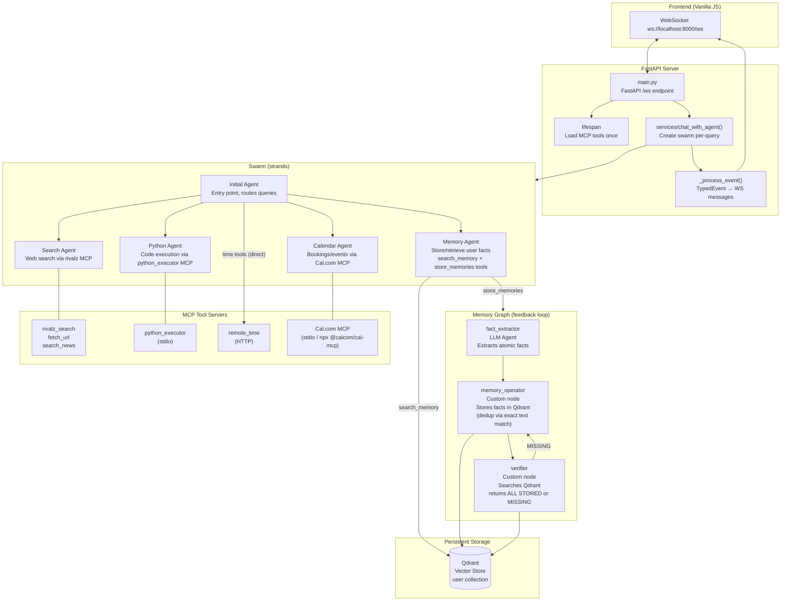

# strands-pa

Multi-agent chat app: Python FastAPI + strands Swarm backend, vanilla JS frontend.

## Setup

- Python 3.11 (`.python-version`)
- `uv` package manager (brew-installed, not in venv). Run commands from `backend/`.
- Create `backend/.env` with: `LLM_BASE_URL`, `LLM_API_KEY`, `LLM_MODEL`, `LANGFUSE_SECRET_KEY` (plus `LANGFUSE_PUBLIC_KEY` if needed).

## Commands (run from `backend/`)

| Action | Command |
|---|---|
| Dev server | `uv run uvicorn app:app --host 0.0.0.0 --port 8000 --reload` |
| Frontend | `cd frontend && python3 -m http.server 8080` |
| Test swarm events | `uv run python test_swarm_events.py` |
| Test WS client | `uv run python test_ws.py` |

No test framework, no lint/typecheck config.

## Architecture



### Agent Roles

| Agent | Entry | Tools | Purpose |
|---|---|---|---|
| **Initial** | Always | `handoff_to_agent` | Routes user requests to the right specialist agent |
| **Search** | Initial | `fetch_url`, `search_news`, `search_web`, `handoff_to_agent` | Web search & content retrieval |
| **Python** | Initial | `python_execute`, `handoff_to_agent` | Run Python code in a sandbox |
| **Calendar** | Initial | Cal.com booking tools, `handoff_to_agent` | Scheduling & events via Cal.com |

| **Memory** | Initial | `search_memory`, `store_memories` | Store & retrieve personal facts |

### Memory Graph Flow

1. **fact_extractor** (LLM Agent, no tools) — Extracts atomic personal facts as a numbered list from the user's message.
2. **memory_operator** (Custom `MultiAgentBase` node) — Parses facts, searches Qdrant for duplicates (exact text match), stores new facts via `add_vector()`.
3. **verifier** (Custom `MultiAgentBase` node) — Re-searches Qdrant for each fact; returns `ALL STORED` or `MISSING:\n- <fact>`.
4. **Feedback loop** — If verifier returns `MISSING`, control loops back to `memory_operator` (up to 12 total node executions).

The Memory Graph is wrapped as a `store_memories` `@tool` called by the in-swarm Memory Agent.

### DI & LLM

- **Container** (`backend/container.py`): `dependency-injector` provides `LLM` model singleton wired into agent constructors and the Memory Graph.
- **LLM**: `OpenAIModel` from strands (supports any OpenAI-compatible provider via `base_url`/`LLM_BASE_URL`).
- **Langfuse**: Initialized at module level in `main.py` on import for observability.

### MCP Tools

Loaded once in FastAPI `lifespan`, cached in module state. `chat_with_agent` re-calls `load_tools()` which returns cached tools.

## Structure

```
backend/         FastAPI WebSocket server
  agents/         Agent definitions (4 sub-agents: Search, Python, Calendar, Memory)
  mcp_servers/    MCP tool clients (rivalz_search, python_executor via stdio, remote_time, cal_mcp via stdio)
  services/       chat_with_agent() — wires swarm + agents + tools
  utils/          LLM model factory, Langfuse client
  vector_store/   Qdrant wrapper
  main.py         FastAPI app, WebSocket /ws endpoint, event processing
frontend/        Vanilla HTML/CSS/JS chat UI
  index.html, script.js, style.css
```

## WebSocket Event Protocol

`_process_event` returns `list[{"type": ...}]` per swarm event.

| WS type | When | Frontend action |
|---|---|---|
| `thinking` | node starts | Show "Thinking..." indicator |
| `node_start` | node starts | "🔄 {node_id} taking control" + thinking |
| `text` | agent streams text | Append to current agent bubble |
| `reasoning` | agent streams reasoning | Show in italic bubble |
| `stop` | agent/node finishes | Hide thinking, clear current bubble |
| `handoff` | handoff between agents | "🔀 from → to" + thinking |
| `done` | final result | Show final text + metadata |
| `error` | exception | Show error text |

## Known Pitfalls

- `SwarmResult.node_history` is `list[SwarmNode]` (not `AgentResult`). To get the last agent's text: `str(result.results[result.node_history[-1].node_id].result)`.
- `Status` enum must be serialized via `.value`, not passed raw.
- `AgentResult.message` is a `dict` (`Message`), not a string — use `str(agent_result)` to get concatenated text.
- `_process_event` returns `list[dict]` (not `dict|None`).
- Frontend connects to `ws://localhost:8000/ws` — update if backend port changes.
- Custom `MultiAgentBase` nodes return `MultiAgentResult(results={node_id: NodeResult(...)})`. The outer Graph wraps this inside `NodeResult.result`, so consumers must unwrap with `isinstance(inner, MultiAgentResult)`.
- Memory Graph nodes receive input as `list[dict]` content blocks (not a raw string). Unmarshal with `" ".join(block.get("text", "") ...)`.
- The LLM emits `reasoningContent is not supported` errors on every call but still produces usable output.
- Cal.com MCP server requires `CAL_API_KEY` in `.env` — generate one at [app.cal.com/settings/developer/api-keys](https://app.cal.com/settings/developer/api-keys).
